Etude théorique de g-means
==================================================

Principales étapes de l’algorithme :
------------	-----------------------------------------------------------

* Initialisation de l'algorithme : k =1 par défaut
* Lancement de kmeans
* Pour chaque cluster, on cherche à savoir si le cluster ressemble à une distribution gaussienne. Pour cela :
	* On cherche à déterminer la direction principale du cluster. On lance donc k-means avec k=2.
	* On projette le cluster sur la droite reliant les deux centroids. On normalise la projection (centrage autours de 0 et mise à l'échelle pour une variance de 1).
	* On applique la fonction A* à la projection. Si on se trouve en dessous de alpha*n, le cluster est validé gaussien. On peut donc étudier le prochain cluster. Si en revanche on se trouve au dessus de alpha*n, le cluster n'est pas validé gaussien. On incrémente donc k et on reprend à la phase 2 de l'algorithme avec k = k+1.
* Lorsque tous les clusters sont validés gaussiens sur une itération, gmeans est terminé.

.. module:: kmeans

L'algorithme gmeans est implémenté dans la fonction *compute_gmeans* du fichier *kmeans.py*.

La fonction compute_gmeans
-----------------------------------------------------------------------

.. autofunction:: kmeans.compute_gmeans

compute_kmeans fait appel au fichier es.py qui regroupe l'ensemble des
opérations d'écriture, de lecture et d'affichages des :ref:`données <data>`

Exemple de déroulement de gmeans (en deux dimensions) :
----------------------------------------------------------------------------------------

Considérons la population suivante :

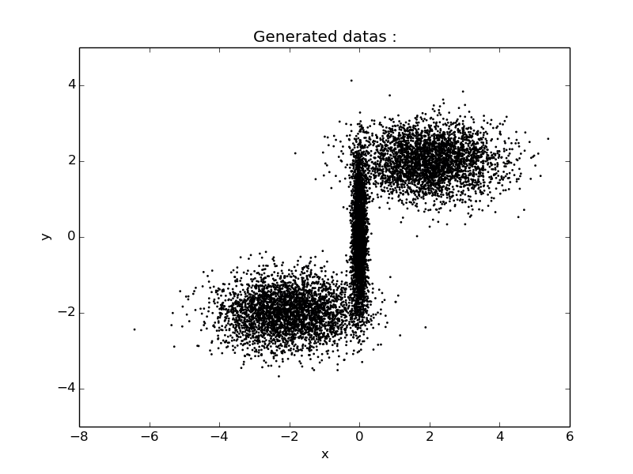

Nous voulons séparer ces observations en trois groupe, nous choisissons donc de lancer l'algorithme gmeans.

.. code-block:: python

			python kmeans.py -d True

Itération 1 - k = 1
~~~~~~~~~~~~~~~~~~~~~~~~~~~~~~~~~~~~~~~~~~~~~~~~~~~~~~~~~~~~~~~~~~~~~~~~~~~~~~~~

g-means commence avec kmeans pour k=1 :

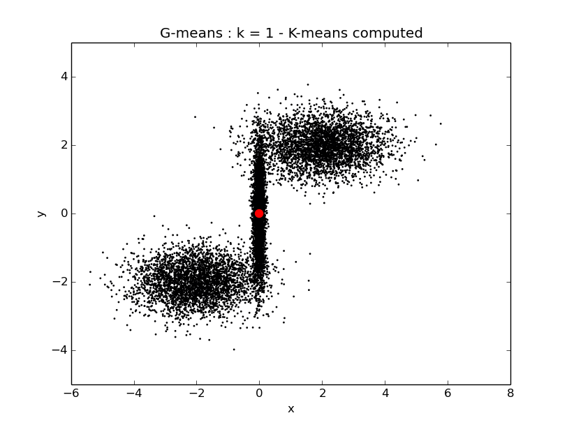

Pour vérifier si le premier cluster est gaussien, nous lancons k-means dessus avec k=2, nous récupérons la direction du cluster et nous projettons le cluster dessus.

.. image:: ../gm/k1d1.png
	:align: center

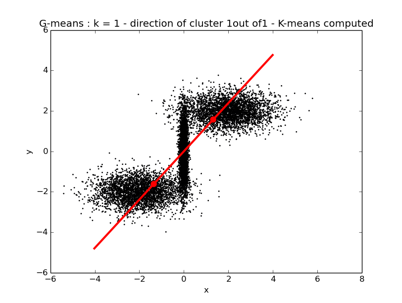

.. image:: ../gm/k1hc1.png
	:align: center

La projection du cluster sur sa direction n'est pas validée gaussienne, on incrémente donc k (k = 1 + 1).

.. code-block:: html

		cluster 0 non validé gaussien : 14.2975999403!
		-------- increasing k --> 2 -----------

Itération 2 - k = 2
~~~~~~~~~~~~~~~~~~~~~~~~~~~~~~~~~~~~~~~~~~~~~~~~~~~~~~~~~~~~~~~~~~~~~~~~~~~~~~~~

On commence avec k-means avec k = 2.

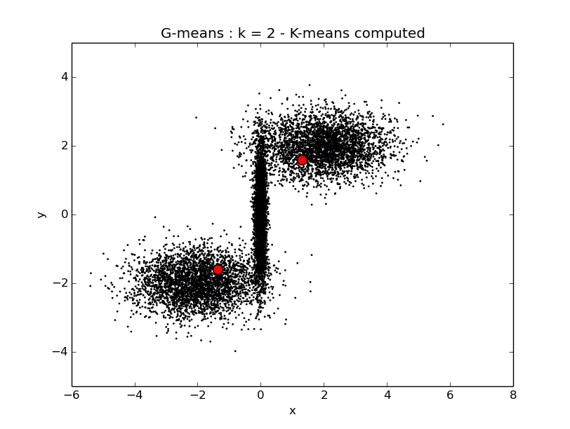

Pour vérifier si le premier cluster est gaussien, nous lancons k-means dessus avec k=2, nous récupérons la direction du cluster et nous projettons le cluster dessus.

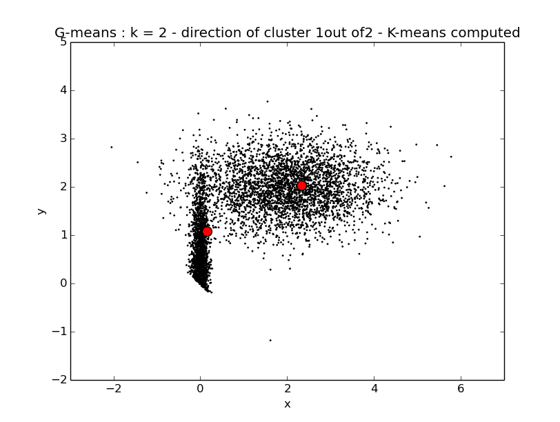

.. image:: ../gm/k2d1_.png
	:align: center

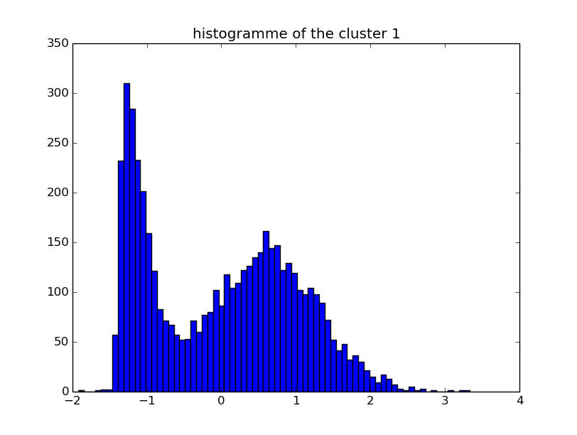

La projection du cluster sur sa direction n'est pas validée gaussienne, on incrémente donc k (k = 2 + 1).

.. code-block:: html

		cluster 0 non validé gaussien : 10.741695949!
		-------- increasing k --> 3 -----------

Itération 3 - k = 3
~~~~~~~~~~~~~~~~~~~~~~~~~~~~~~~~~~~~~~~~~~~~~~~~~~~~~~~~~~~~~~~~~~~~~~~~~~~~~~~~

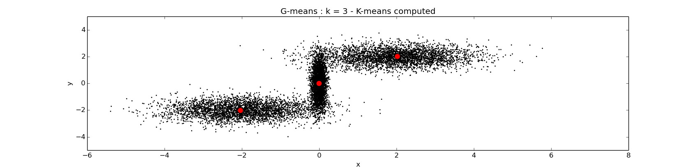

Pour vérifier si le premier cluster est gaussien, nous lancons k-means dessus avec k=2, nous récupérons la direction du cluster et nous projettons le cluster dessus.

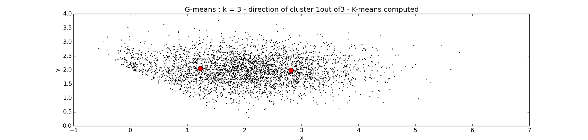

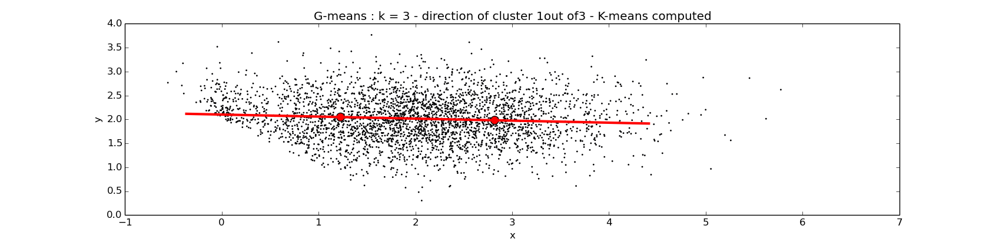

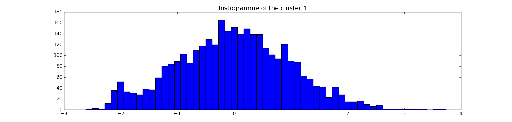

Le cluster 1 est validé gaussien, nous passons donc au cluster suivant.

.. code-block:: html

		cluster 1 validé gaussien : 0.0797061693984!

.. image:: ../gm/k3d2.png
	:align: center

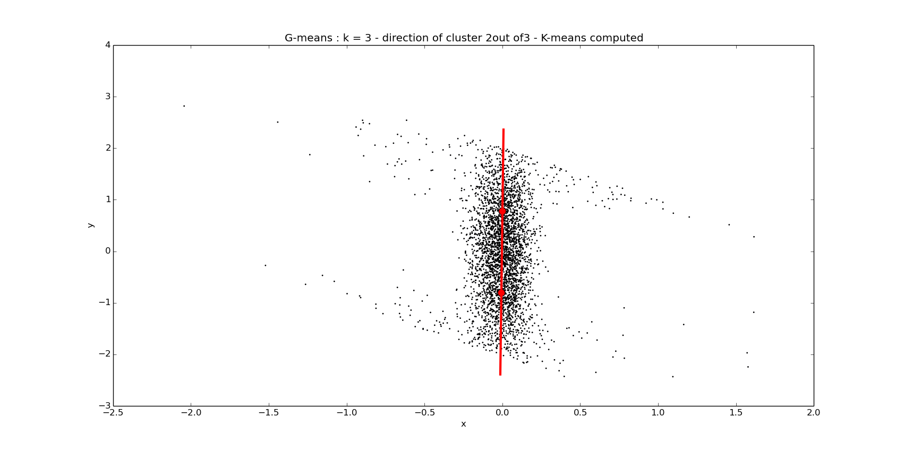

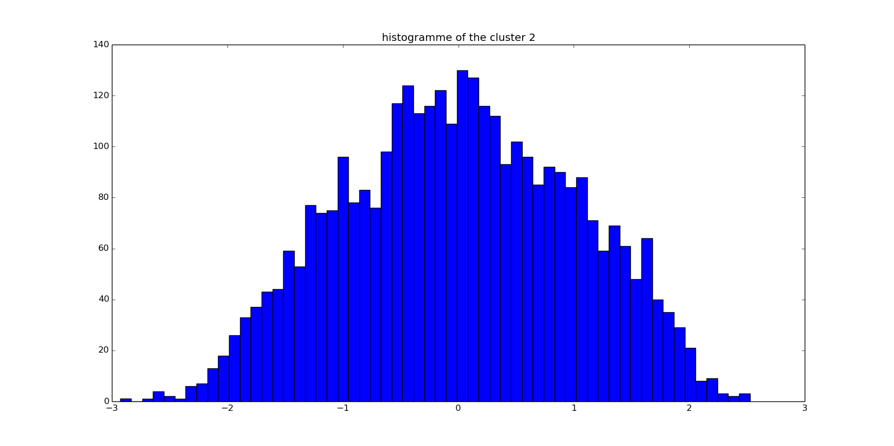

Le cluster 2 est validé gaussien, nous passons donc au cluster suivant.

.. code-block:: html

		cluster 2 validé gaussien : 0.546286569869!

.. image:: ../gm/k3d3.png
	:align: center

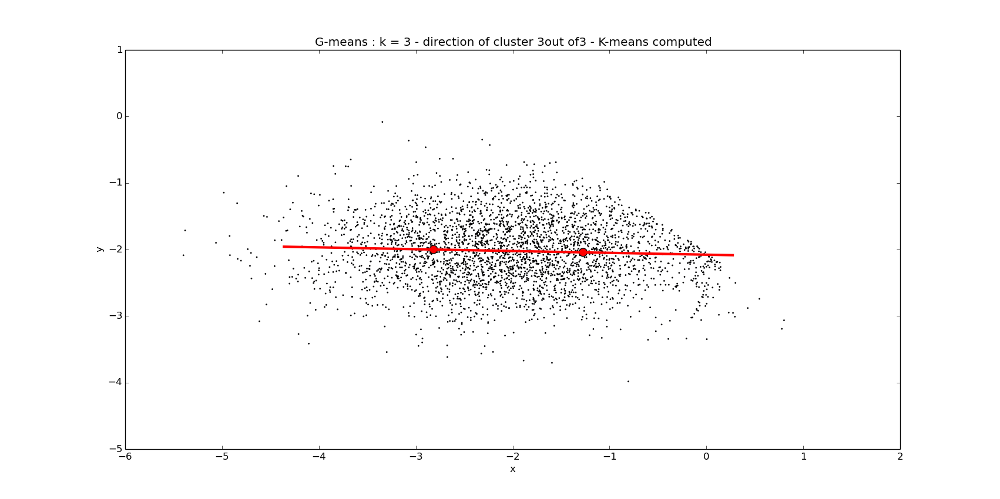

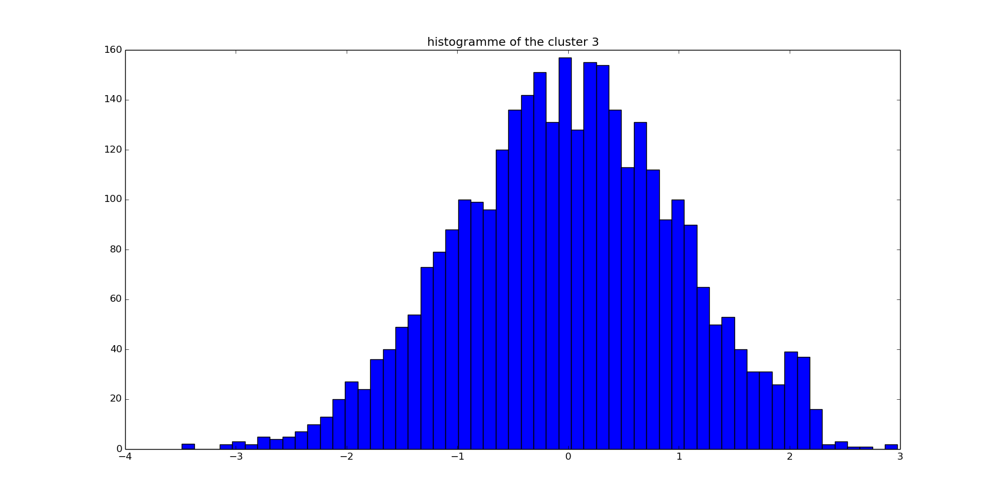

Le cluster 3 est également validé gaussien.

.. code-block:: html

		cluster 3 validé gaussien : 0.0510247798951!

Tous les clusters sont validés gaussien, l'algorithme g-means est donc terminé pour k = 3.

.. image:: ../gm/k3ok.png
	:align: center
