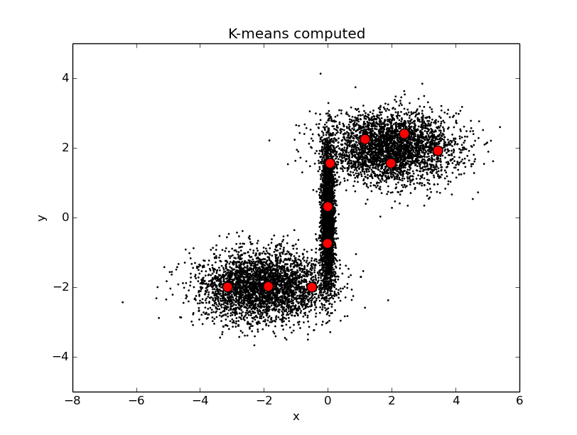
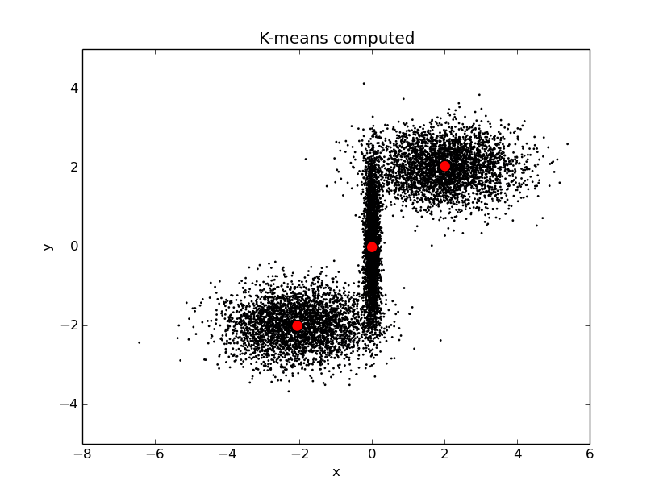

.. _random:
Données aléatoires
===========================================================

Le fichier *genData.py* permet de générer des gaussiennes en dimension n, grâce à la commande suivante :

	.. code-block:: html

		python genData.py -t random

La méthode utilisée est alors gen_random_data, qui créé les gaussiennes

.. autofunction:: genData.gen_random_data

Plusieurs configurations de gaussiennes sont proposées en exemple.
Il est possible de changer l'exemple généré en utilisant l'option -s : par exemple, -s 1 va générer le premier exemple, -s 2 le deuxième, etc.

	.. code-block:: html

		python genData.py -t random -s 1

Il est également possible d'afficher les deux premières coordonnées des données générées avec l'option -d :

	.. code-block:: html

		python genData.py -t random -s 1 -d True

Par exemple, si l'on essaie d'analyser les observations suivantes :

	.. code-block:: html

		python genData.py -s 3 -d True

.. image:: ../gaussiennes.png
	:align: center

k-means avec k = 10 nous permet d'obtenir le résultat suivant :

	.. code-block:: html

		python kmeans.py -g False -k 10 -d True

Si les données sont bien représentés, on voit toutefois qu'il y évidemment plusieurs centroids par gaussiennes. Si on espère trouver un centroid par gaussienne, il faut lancer g-means :

	.. code-block:: html

		python kmeans.py -d True

