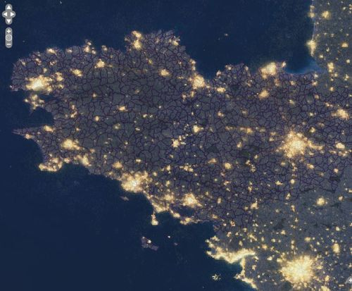
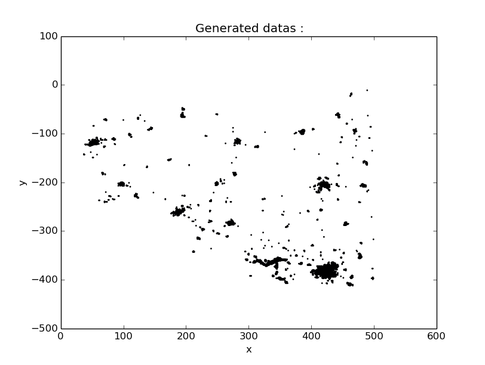

.. _sky:
La Bretagne vue du ciel !
================================================

Le fichier *genData.py* permet de générer des données à partir une image satellite de nuit.
Il faut pour cela placer l'image dans le dossier input et utiliser la commande suivante :

	.. code-block:: html

		python genData.py -type picture -name nom_de_la_photo

La méthode utilisée est alors gen_picture_data.

.. autofunction:: genData.gen_picture_data

Il est également possible d'afficher les données générées avec l'option -d :

	.. code-block:: html

		python genData.py -type picture -name bretagne.jpg -d True

Par défault, si l'option -name n'est pas utilisé, l'image bretagne.jpg est utilisé.
Voivi l'image originale :

Voici ensuite les données générées grâce à cette image :

Et enfin voici le résultat de kmeans sur ces images :

.. image:: ../bretagne_traitedData.png
	:align: center